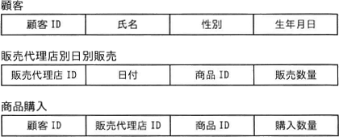

# [令和6年秋期 午前 問28](https://www.ap-siken.com/kakomon/06_aki/q28.html)

#問題 #テクノロジ #データベース #データ操作

解説を表示解説を隠す

<strong>問28</strong>　化粧品の製造を行っているA社では，販売代理店を通じて商品販売を行っている。今後の販売戦略に活用するために，次の三つの表を設計した。これらの表を用いるだけでは得ることのできない情報はどれか。 

<ul class="ap-choices">
<li class="ap-choice-item ap-wrong">

ア　商品ごとの販売数量の日別差異

「販売代理店別日別販売」表に商品ID、販売数量、日付があるため，これらを集計すれば得られる。

</li>
<li class="ap-choice-item ap-wrong">

イ　性別ごとの売れ筋商品

「商品購入」表の顧客IDをキーに「顧客」表と結合し，性別と商品IDでグループ化すれば得られる。

</li>
<li class="ap-choice-item ap-correct">

ウ　販売代理店ごとの購入者数の日別差異

正しい。この3つの表からは，ある日における販売代理店ごとの顧客数は得られない。日付を「商品購入」表にも持たせれば，販売代理店ごとの日別購入者数は導出できる。

</li>
<li class="ap-choice-item ap-wrong">

エ　販売代理店ごとの売れ筋商品

「販売代理店別日別販売」表の商品IDと販売数量を，販売代理店でグループ化すれば得られる。

</li>
</ul>

<h4>解説</h4>

「販売代理店別日別販売」表には商品ID、販売数量、日付があり，商品ごとの販売数量の日別差異（ア）は集計で得られる。同表の商品IDと販売数量を販売代理店でグループ化すれば，販売代理店ごとの売れ筋商品（エ）も得られる。「商品購入」表の顧客IDをキーに「顧客」表と結合し，性別と商品IDでグループ化すれば，性別ごとの売れ筋商品（イ）も得られる。一方，この3つの表だけではある日における販売代理店ごとの顧客数（ウ）は得られない。日付を「販売代理店別日別販売」表ではなく「商品購入」表にも持たせれば，販売代理店ごとの日別購入者数は「商品購入」表から導出できる。

