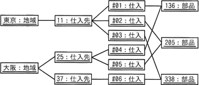
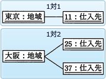
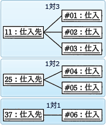
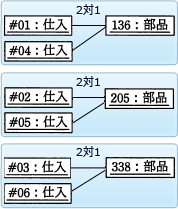

# [令和6年秋期 午前 問29](https://www.ap-siken.com/kakomon/06_aki/q29.html)

#問題 #テクノロジ #データベース #データベース設計

解説を表示解説を隠す

<strong>問29</strong>　次のオブジェクト図(インスタンスを表す図)に対応する概念データモデルはどれか。ここで，オブジェクト図及び概念データモデルの表記にはUMLを用いる。 

<ul class="ap-choices">
<li class="ap-choice-item ap-wrong">

ア　

各<a href="用語/関連" class="internal-link" data-href="用語/関連">関連</a>の多重度が、<a href="用語/オブジェクト図" class="internal-link" data-href="用語/オブジェクト図">オブジェクト図</a>の<a href="用語/インスタンス" class="internal-link" data-href="用語/インスタンス">インスタンス</a>数から導かれる組合せと一致しません。

</li>
<li class="ap-choice-item ap-correct">

イ　

正しい。「地域」―「仕入先」「仕入先」―「仕入」「仕入」―「部品」の3つの多重度が<a href="用語/オブジェクト図" class="internal-link" data-href="用語/オブジェクト図">オブジェクト図</a>と一致します。

</li>
<li class="ap-choice-item ap-wrong">

ウ　

各<a href="用語/関連" class="internal-link" data-href="用語/関連">関連</a>の多重度が、<a href="用語/オブジェクト図" class="internal-link" data-href="用語/オブジェクト図">オブジェクト図</a>の<a href="用語/インスタンス" class="internal-link" data-href="用語/インスタンス">インスタンス</a>数から導かれる組合せと一致しません。

</li>
<li class="ap-choice-item ap-wrong">

エ　

各<a href="用語/関連" class="internal-link" data-href="用語/関連">関連</a>の多重度が、<a href="用語/オブジェクト図" class="internal-link" data-href="用語/オブジェクト図">オブジェクト図</a>の<a href="用語/インスタンス" class="internal-link" data-href="用語/インスタンス">インスタンス</a>数から導かれる組合せと一致しません。

</li>
</ul>

<h4>解説</h4>

<a href="用語/オブジェクト図" class="internal-link" data-href="用語/オブジェクト図">オブジェクト図</a>は、ある特定の時点でのオブジェクトの<a href="用語/インスタンス" class="internal-link" data-href="用語/インスタンス">インスタンス</a>間の静的な構造を記述する図です。<a href="用語/クラス図" class="internal-link" data-href="用語/クラス図">クラス図</a>が<a href="用語/クラス" class="internal-link" data-href="用語/クラス">クラス</a>間の静的な<a href="用語/関連" class="internal-link" data-href="用語/関連">関連</a>を定義するのに対し、<a href="用語/オブジェクト図" class="internal-link" data-href="用語/オブジェクト図">オブジェクト図</a>はその<a href="用語/クラス図" class="internal-link" data-href="用語/クラス図">クラス図</a>から具体的な<a href="用語/インスタンス" class="internal-link" data-href="用語/インスタンス">インスタンス</a>（実際のオブジェクト）がどのように生成され、<a href="用語/関連" class="internal-link" data-href="用語/関連">関連</a>をもつのかを示します。

設問では<a href="用語/オブジェクト図" class="internal-link" data-href="用語/オブジェクト図">オブジェクト図</a>と<a href="用語/クラス図" class="internal-link" data-href="用語/クラス図">クラス図</a>の対応が問われています。<a href="用語/クラス図" class="internal-link" data-href="用語/クラス図">クラス図</a>の多重度は、ある<a href="用語/クラス" class="internal-link" data-href="用語/クラス">クラス</a>の<a href="用語/インスタンス" class="internal-link" data-href="用語/インスタンス">インスタンス</a>に対し他の<a href="用語/クラス" class="internal-link" data-href="用語/クラス">クラス</a>の<a href="用語/インスタンス" class="internal-link" data-href="用語/インスタンス">インスタンス</a>がいくつ<a href="用語/関連" class="internal-link" data-href="用語/関連">関連</a>するかを表すので、<a href="用語/インスタンス" class="internal-link" data-href="用語/インスタンス">インスタンス</a>同士の数の関係に着目します。

まず"地域"と"仕入先"の関係を見ると、下図のように1つの"地域"<a href="用語/インスタンス" class="internal-link" data-href="用語/インスタンス">インスタンス</a>に1つ以上の"仕入先"<a href="用語/インスタンス" class="internal-link" data-href="用語/インスタンス">インスタンス</a>が<a href="用語/関連" class="internal-link" data-href="用語/関連">関連</a>付けられています。したがって、"地域"<a href="用語/クラス" class="internal-link" data-href="用語/クラス">クラス</a>と"仕入先"<a href="用語/クラス" class="internal-link" data-href="用語/クラス">クラス</a>の多重度は「1対多（1　*）」です。1つの"地域"の対応する"仕入先"は1つ以上存在し、1つの"仕入先"に対応する"地域"は常に1つということです。

次に"仕入先"と"仕入"の関係を見ると、これも上記と同じく1つの"仕入先"<a href="用語/インスタンス" class="internal-link" data-href="用語/インスタンス">インスタンス</a>に1つ以上の"仕入"<a href="用語/インスタンス" class="internal-link" data-href="用語/インスタンス">インスタンス</a>が<a href="用語/関連" class="internal-link" data-href="用語/関連">関連</a>付けられています。したがって、"仕入先"<a href="用語/クラス" class="internal-link" data-href="用語/クラス">クラス</a>と"仕入"<a href="用語/クラス" class="internal-link" data-href="用語/クラス">クラス</a>の多重度は「1対多（1　*）」です。

最後に"仕入"と"部品"の関係を見ると、1つの"部品"<a href="用語/インスタンス" class="internal-link" data-href="用語/インスタンス">インスタンス</a>が1つ以上の"仕入"<a href="用語/インスタンス" class="internal-link" data-href="用語/インスタンス">インスタンス</a>に<a href="用語/関連" class="internal-link" data-href="用語/関連">関連</a>付けられています。よって、"仕入"<a href="用語/クラス" class="internal-link" data-href="用語/クラス">クラス</a>と"部品"<a href="用語/クラス" class="internal-link" data-href="用語/クラス">クラス</a>と多重度は「多対1（*　1）」になります。

この3つの多重度の関係を適切に表現している<a href="用語/概念データモデル" class="internal-link" data-href="用語/概念データモデル">概念データモデル</a>は「イ」です。

