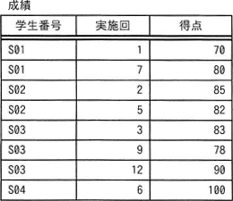
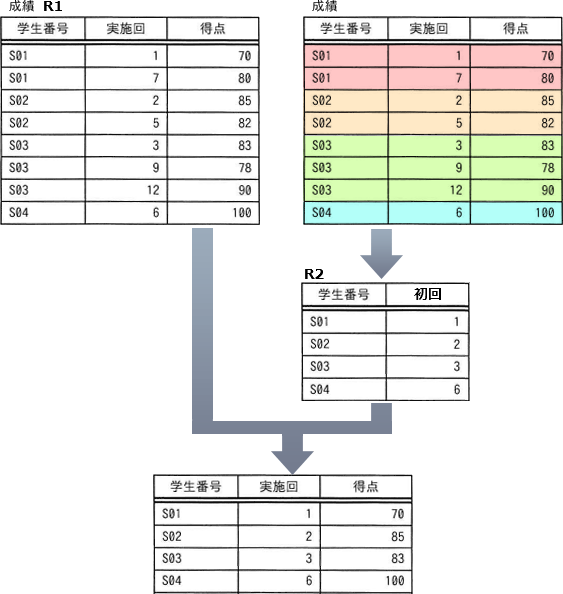
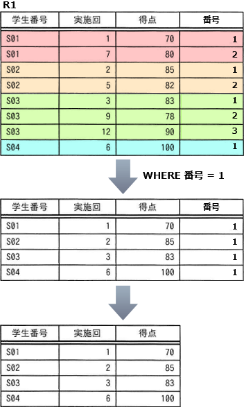

# [令和6年秋期 午前 問30](https://www.ap-siken.com/kakomon/06_aki/q30.html)

#問題 #テクノロジ #データベース #データ操作

解説を表示解説を隠す

<strong>問30</strong>　"成績"表に対して，SQL文1と同一の結果を得るために，SQL文2のaに入れる字句はどれか。 〔SQL文1〕 SELECT R1.学生番号，R1.実施回，R1.得点 FROM 成績 R1 INNER JOIN (SELECT 学生番号，MIN(実施回) AS 初回 FROM 成績 GROUP BY 学生番号) R2 ON R1.学生番号 = R2.学生番号 AND R1.実施回 = R2.初回 〔SQL文2〕 SELECT 学生番号，実施回，得点 FROM (SELECT 学生番号，実施回，得点，ROW_NUMBER() OVER(a) AS 番号 FROM 成績) R1 WHERE R1.番号 = 1 

<ul class="ap-choices">
<li class="ap-choice-item ap-wrong">

ア　ORDER BY 学生番号，実施回

PARTITION BY句が無いため，学生番号ごとに番号を振ることができません。

</li>
<li class="ap-choice-item ap-correct">

イ　PARTITION BY 学生番号 ORDER BY 実施回

正しい。学生番号で分割し実施回の昇順で番号を付ければ，初回の行に番号1が与えられます。

</li>
<li class="ap-choice-item ap-wrong">

ウ　PARTITION BY 学生番号 ORDER BY 得点 ASC

実施回ではなく得点で整列するため，初回の行に番号1が付きません。

</li>
<li class="ap-choice-item ap-wrong">

エ　PARTITION BY 学生番号 ORDER BY 得点 DESC

実施回ではなく得点の降順で整列するため，初回の行に番号1が付きません。

</li>
</ul>

<h4>解説</h4>

まず〔<a href="用語/SQL" class="internal-link" data-href="用語/SQL">SQL</a>文1〕の結果を考えます。

〔<a href="用語/SQL" class="internal-link" data-href="用語/SQL">SQL</a>文1〕は、①成績表から学生番号、学生ごとに最も小さい実施回の値（初回）を集計した表R2を得る、②それを成績表R1と結合する、③学生番号、実施回、得点の3つの列を抜き出す という操作を行うので、次のように学生ごとに初回の得点のみが選択された結果となります。

この表を得るために〔<a href="用語/SQL" class="internal-link" data-href="用語/SQL">SQL</a>文2〕の空欄aに入れるべき字句を考えます。

〔<a href="用語/SQL" class="internal-link" data-href="用語/SQL">SQL</a>文2〕では番号列の値を得るために、ROW_NUMBER()およびOVER句が使用されています。OVER句とPARTITION BY句の組合せにより実現される構文は<a href="用語/ウィンドウ関数" class="internal-link" data-href="用語/ウィンドウ関数">ウィンドウ関数</a>（分析関数）と呼ばれ、テーブル内の行の集合を定義し、それを関数の入力値とする機能です。GROUP BY句と異なり行の集約はせず、元の行を保持したまま計算を行います。

OVER句は<a href="用語/ウィンドウ関数" class="internal-link" data-href="用語/ウィンドウ関数">ウィンドウ関数</a>を宣言する役割を持ち、PARTITION BY句はデータをどのように分割するかを指定します。この設問ではPARTITION BY 学生番号と指定するため、成績表が学生番号ごとのパーテンションに分割されます。そして、行が属するパーテーション内における各行の行番号がROW_NUMBER()により割り当てられます。

〔<a href="用語/SQL" class="internal-link" data-href="用語/SQL">SQL</a>文1〕では初回の行のみを結果として出力していること、WHERE句で番号が1の行を選択対象としているという2点から、ROW_NUMBER()の入力値となるパーテーションとしては、実施回の昇順（ORDER BY 実施回）で整列したパーテーションが適切であることがわかります。実施回の昇順で整列したパーテーションであれば、初回の行には番号1が与えられ、それ以外の実施回の行には1以外が与えられるため、WHERE句で初回の行のみを選択することができます。

したがって「イ」が正解となります。

