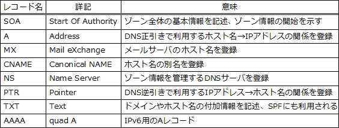

# [令和6年秋期 午前 問33](https://www.ap-siken.com/kakomon/06_aki/q33.html)

#問題 #テクノロジ #ネットワーク #通信プロトコル

解説を表示解説を隠す

<strong>問33</strong>　DNSに関する記述のうち，適切なものはどれか。

<ul class="ap-choices">
<li class="ap-choice-item ap-wrong">

ア　DNSサーバのホスト名を登録するレコードをMXレコードという。

<a href="用語/DNS" class="internal-link" data-href="用語/DNS">DNS</a>サーバのホスト名を登録する<a href="用語/レコード" class="internal-link" data-href="用語/レコード">レコード</a>はNS<a href="用語/レコード" class="internal-link" data-href="用語/レコード">レコード</a>です。MXはメールサーバを登録する<a href="用語/レコード" class="internal-link" data-href="用語/レコード">レコード</a>です。

</li>
<li class="ap-choice-item ap-wrong">

イ　DNSサーバに問い合わせを行うソフトウェアをレゾリューションという。

<a href="用語/DNS" class="internal-link" data-href="用語/DNS">DNS</a>サーバに問い合わせを行うソフトウェアはリゾルバです。レゾリューションは、<a href="用語/DNS" class="internal-link" data-href="用語/DNS">DNS</a>で名前解決をする（ネームサーバから情報を取り出す）ことを指します。

</li>
<li class="ap-choice-item ap-correct">

ウ　IPアドレスに対応するホスト名を調べることを逆引きという。

正しい。ホスト名から<a href="用語/IPアドレス" class="internal-link" data-href="用語/IPアドレス">IPアドレス</a>を調べるのは正引き、反対に<a href="用語/IPアドレス" class="internal-link" data-href="用語/IPアドレス">IPアドレス</a>に対応するホスト名を調べるのは逆引きと言います。

</li>
<li class="ap-choice-item ap-wrong">

エ　ホスト名に対し別名を登録するレコードをNSレコードという。

ホスト名に対し別名を登録する<a href="用語/レコード" class="internal-link" data-href="用語/レコード">レコード</a>はCNAME<a href="用語/レコード" class="internal-link" data-href="用語/レコード">レコード</a>です。NS<a href="用語/レコード" class="internal-link" data-href="用語/レコード">レコード</a>はその<a href="用語/ドメイン" class="internal-link" data-href="用語/ドメイン">ドメイン</a>を管理するネームサーバ（<a href="用語/DNS" class="internal-link" data-href="用語/DNS">DNS</a>サーバ）を登録する<a href="用語/レコード" class="internal-link" data-href="用語/レコード">レコード</a>です。

</li>
</ul>

<h4>解説</h4>

正引きはホスト名から<a href="用語/IPアドレス" class="internal-link" data-href="用語/IPアドレス">IPアドレス</a>を調べること、逆引きは<a href="用語/IPアドレス" class="internal-link" data-href="用語/IPアドレス">IPアドレス</a>に対応するホスト名を調べることです。正引きに使用するのはA<a href="用語/レコード" class="internal-link" data-href="用語/レコード">レコード</a>、逆引きに使用するのはPTR<a href="用語/レコード" class="internal-link" data-href="用語/レコード">レコード</a>です。

