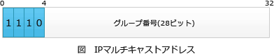

# [令和6年秋期 午前 問35](https://www.ap-siken.com/kakomon/06_aki/q35.html)

#問題 #テクノロジ #ネットワーク #通信プロトコル

解説を表示解説を隠す

<strong>問35</strong>　クラスDのIPアドレスを使用するのはどの場合か。

<ul class="ap-choices">
<li class="ap-choice-item ap-wrong">

ア　端末数が250台程度までの比較的小規模なホストアドレスを割り振る。

これはクラスCの<a href="用語/IPアドレス" class="internal-link" data-href="用語/IPアドレス">IPアドレス</a>の用途です。

</li>
<li class="ap-choice-item ap-wrong">

イ　端末数が65,000台程度の中規模なホストアドレスを割り振る。

これはクラスBの<a href="用語/IPアドレス" class="internal-link" data-href="用語/IPアドレス">IPアドレス</a>の用途です。

</li>
<li class="ap-choice-item ap-wrong">

ウ　プライベートアドレスを割り振る。

クラスDの<a href="用語/IPアドレス" class="internal-link" data-href="用語/IPアドレス">IPアドレス</a>は、全32ビットがネットワーク部でありホストアドレス部はありません。このため、<a href="用語/プライベートIPアドレス" class="internal-link" data-href="用語/プライベートIPアドレス">プライベートIPアドレス</a>として割り当てることはできません。

</li>
<li class="ap-choice-item ap-correct">

エ　マルチキャストアドレスを割り振る。

正しい。クラスDは<a href="用語/マルチキャスト" class="internal-link" data-href="用語/マルチキャスト">マルチキャスト</a>通信専用のアドレスです。

</li>
</ul>

<h4>解説</h4>

<a href="用語/IPアドレス" class="internal-link" data-href="用語/IPアドレス">IPアドレス</a>空間は、<a href="用語/IPアドレス" class="internal-link" data-href="用語/IPアドレス">IPアドレス</a>の先頭ビットによってクラスA～Eに分類されます。クラスDの<a href="用語/IPアドレス" class="internal-link" data-href="用語/IPアドレス">IPアドレス</a>の範囲は、先頭ビットが「1110」である 224.0.0.0～239.255.255.255 です。

クラスA～Cはホストアドレスの割り振りに使用されますが、クラスDは、特定のグループに所属する全てのホストに同時送信を行う<a href="用語/マルチキャスト" class="internal-link" data-href="用語/マルチキャスト">マルチキャスト</a>通信用に予約されたアドレスです。32ビットのうち先頭4ビットがクラスDを表す「1110」で、残りの28ビットが送信対象となるグループ番号を指定する部分として使われます。したがって正解は「エ」です。

