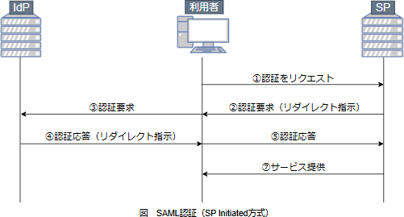

# [令和6年秋期 午前 問37](https://www.ap-siken.com/kakomon/06_aki/q37.html)

#問題 #テクノロジ #セキュリティ #情報セキュリティ

解説を表示解説を隠す

<strong>問37</strong>　企業内のクライアントからクラウドサービスへのアクセスにSAML認証を利用したときのシステムの動作に関する記述のうち，適切なものはどれか。ここで，利用者IDとパスワードは企業内のディレクトリサービスで管理し，利用者認証は企業内の認証サーバで行う。

<ul class="ap-choices">
<li class="ap-choice-item ap-wrong">

ア　クラウドサービスがディレクトリサービスに利用者IDとパスワードの送信を要求する。

<a href="用語/SAML" class="internal-link" data-href="用語/SAML">SAML</a>アサーションがやり取りされ、利用者IDとパスワードは送受信されません。

</li>
<li class="ap-choice-item ap-wrong">

イ　認証サーバからクラウドサービスに，利用者IDとパスワードを送信する。

<a href="用語/SAML" class="internal-link" data-href="用語/SAML">SAML</a>アサーションがやり取りされ、利用者IDとパスワードは送受信されません。

</li>
<li class="ap-choice-item ap-correct">

ウ　認証サーバから認証結果をクライアント経由でクラウドサービスに送信する。

正しい。認証サーバが利用者を認証すると<a href="用語/SAML" class="internal-link" data-href="用語/SAML">SAML</a>アサーションが発行され、クライアントを経由してクラウドサービスに渡されます。

</li>
<li class="ap-choice-item ap-wrong">

エ　利用者が入力したパスワードとクラウドサービスから送信された乱数を組み合わせ，さらにハッシュ値に変換した結果をクライアントからクラウドサービスに送信する。

クラウドサービスでは認証情報を管理していないため、チャレンジレスポンス認証を利用することはできません。

</li>
</ul>

<h4>解説</h4>

<a href="用語/SAML" class="internal-link" data-href="用語/SAML">SAML</a>認証は、<a href="用語/SAML" class="internal-link" data-href="用語/SAML">SAML</a>(サムエル)というXMLベースのメッセージフォーマットを介して認証情報をやり取りすることで、<a href="用語/シングルサインオン" class="internal-link" data-href="用語/シングルサインオン">シングルサインオン</a>を実現するプロトコルです。認証の基本的な流れは、IdP（認証提供者）が利用者を認証し<a href="用語/SAML" class="internal-link" data-href="用語/SAML">SAML</a>アサーションを発行し、SP（サービス提供者）が<a href="用語/SAML" class="internal-link" data-href="用語/SAML">SAML</a>アサーションを受け取り利用者のアクセスを許可することです。認証サーバが<a href="用語/SAML" class="internal-link" data-href="用語/SAML">SAML</a>アサーションを発行し、それが利用者のWebブラウザを経由してサービス提供者に渡されることは同じです。

