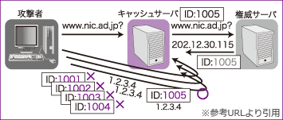

# [令和6年秋期 午前 問42](https://www.ap-siken.com/kakomon/06_aki/q42.html)

#問題 #テクノロジ #セキュリティ #情報セキュリティ対策

解説を表示解説を隠す

<strong>問42</strong>　DNSキャッシュポイズニング攻撃に対して有効な対策はどれか。

<ul class="ap-choices">
<li class="ap-choice-item ap-wrong">

ア　DNSサーバにおいて，侵入したマルウェアをリアルタイムに隔離する。

<a href="用語/DNSキャッシュポイズニング" class="internal-link" data-href="用語/DNSキャッシュポイズニング">DNSキャッシュポイズニング</a>攻撃は、マルウェアによって引き起こされる攻撃ではないため不適切です。

</li>
<li class="ap-choice-item ap-correct">

イ　DNS問合せに使用するDNSヘッダー内のIDを固定せずにランダムに変更する。

正しい。<a href="用語/DNS" class="internal-link" data-href="用語/DNS">DNS</a>問合せごとに異なるIDを設定することが、攻撃成立の可能性を下げる有効な対策です。

</li>
<li class="ap-choice-item ap-wrong">

ウ　DNS問合せに使用する送信元ポート番号を53番に固定する。

53番に固定されていると応答<a href="用語/パケット" class="internal-link" data-href="用語/パケット">パケット</a>の偽装が簡単になるため不適切です。ランダムに選択した<a href="用語/ポート番号" class="internal-link" data-href="用語/ポート番号">ポート番号</a>を使用することが対策となります（ソースポートランダマイゼーション）。

</li>
<li class="ap-choice-item ap-wrong">

エ　外部からのDNS問合せに対しては，宛先ポート番号53のものだけに応答する。

外部からの<a href="用語/DNS" class="internal-link" data-href="用語/DNS">DNS</a>問合せに無制限に応答している状態だと攻撃対象や<a href="用語/踏み台" class="internal-link" data-href="用語/踏み台">踏み台</a>に悪用されるリスクが高まります。再帰的な問合せはイントラネットからのみ許可し、インターネットからは拒否することが推奨されます。

</li>
</ul>

<h4>解説</h4>

<strong><a href="用語/DNSキャッシュポイズニング" class="internal-link" data-href="用語/DNSキャッシュポイズニング">DNSキャッシュポイズニング</a>攻撃</strong>は、<a href="用語/DNS" class="internal-link" data-href="用語/DNS">DNS</a>キャッシュサーバのキャッシュに偽の情報を登録させ、そのキャッシュを参照した利用者を悪意のあるサイトに誘導する攻撃です。

<a href="用語/DNSキャッシュポイズニング" class="internal-link" data-href="用語/DNSキャッシュポイズニング">DNSキャッシュポイズニング</a>攻撃の一般的な攻撃手順は次のとおりです（参考URLからの転載）。 ①攻撃者は、偽の情報を送り込みたい<a href="用語/ドメイン" class="internal-link" data-href="用語/ドメイン">ドメイン</a>名について、ターゲットとなるキャッシュサーバに問い合わせを送る ②問い合わせを受けたキャッシュサーバは、外部の権威サーバに問い合わせる ③攻撃者は、権威サーバから正しい応答が返ってくる前に、偽の応答<a href="用語/パケット" class="internal-link" data-href="用語/パケット">パケット</a>をキャッシュサーバに送り込む ④キャッシュサーバが③で送った問い合わせメッセージのIDと、攻撃者が④で送った偽のメッセージのIDが一致すれば攻撃成功

参考URL: <a href="用語/DNSキャッシュポイズニング" class="internal-link" data-href="用語/DNSキャッシュポイズニング">DNSキャッシュポイズニング</a>(JPNIC) https://www.nic.ad.jp/ja/newsletter/No40/0800.html

