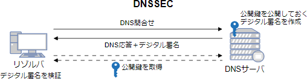

# [令和6年秋期 午前 問44](https://www.ap-siken.com/kakomon/06_aki/q44.html)

#問題 #テクノロジ #セキュリティ #セキュリティ実装技術

解説を表示解説を隠す

<strong>問44</strong>　DNSSECの仕様はどれか。

<ul class="ap-choices">
<li class="ap-choice-item ap-wrong">

ア　DNSキャッシュサーバで，権威DNSサーバに名前を問い合わせるときの送信元ポート番号を問合せのたびにランダムに変える。

これはソースポートランダマイゼーションの説明です。

</li>
<li class="ap-choice-item ap-correct">

イ　権威DNSサーバで公開鍵を公開し，秘密鍵を使ってリソースレコードにデジタル署名を付与する。DNSキャッシュサーバで，権威DNSサーバから受信したリソースレコードのデジタル署名を検証する。

正しい。<a href="用語/DNSSEC" class="internal-link" data-href="用語/DNSSEC">DNSSEC</a>の説明です。

</li>
<li class="ap-choice-item ap-wrong">

ウ　電子メールを送信するメールサーバのIPアドレスを権威DNSサーバに登録する。電子メールを受信するメールサーバで，権威DNSサーバに登録されている情報を用いて，送信元メールサーバのIPアドレスを検証する。

これは<a href="用語/SPF" class="internal-link" data-href="用語/SPF">SPF</a>(Sender Policy Framework)の説明です。

</li>
<li class="ap-choice-item ap-wrong">

エ　電子メールを送信するメールサーバの公開鍵を権威DNSサーバで公開し，秘密鍵を使って電子メールにデジタル署名を付与する。電子メールを受信するメールサーバで，電子メールのデジタル署名を検証する。

これは<a href="用語/DKIM" class="internal-link" data-href="用語/DKIM">DKIM</a>(DomainKeys Identified Mail)の説明です。

</li>
</ul>

<h4>解説</h4>

<a href="用語/DNSSEC" class="internal-link" data-href="用語/DNSSEC">DNSSEC</a>(<a href="用語/DNS" class="internal-link" data-href="用語/DNS">DNS</a> Security Extensions)は、<a href="用語/DNS" class="internal-link" data-href="用語/DNS">DNS</a>における応答の正当性を保証するための拡張仕様です。<a href="用語/DNSSEC" class="internal-link" data-href="用語/DNSSEC">DNSSEC</a>では名前解決の応答パケットに<a href="用語/デジタル署名" class="internal-link" data-href="用語/デジタル署名">デジタル署名</a>を付加することで、正当な管理者によって生成された応答レコードであること、また応答レコードが<a href="用語/改ざん" class="internal-link" data-href="用語/改ざん">改ざん</a>されていないことの検証が可能になります。

<a href="用語/DNSキャッシュポイズニング" class="internal-link" data-href="用語/DNSキャッシュポイズニング">DNSキャッシュポイズニング</a>攻撃では、攻撃者から送り付けられた偽の応答パケットをキャッシュサーバが登録してしまうことによって攻撃が成立します。このため、<a href="用語/DNSSEC" class="internal-link" data-href="用語/DNSSEC">DNSSEC</a>を導入して応答パケットの正当性をチェックすることが根本的な対策となります。しかし、各<a href="用語/DNS" class="internal-link" data-href="用語/DNS">DNS</a>サーバの<a href="用語/DNSSEC" class="internal-link" data-href="用語/DNSSEC">DNSSEC</a>対応、<a href="用語/デジタル署名" class="internal-link" data-href="用語/デジタル署名">デジタル署名</a>に必要な鍵の管理や配布方法の確立、ルートやTLDの署名が必要なことなどいくつかの課題があるため、普及に当たって今しばらく時間が必要な状況です。

したがって正しい動作は「イ」です。

