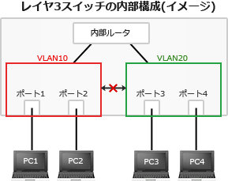

# [令和6年秋期 午前 問45](https://www.ap-siken.com/kakomon/06_aki/q45.html)

#問題 #テクノロジ #セキュリティ #情報セキュリティ対策

解説を表示解説を隠す

<strong>問45</strong>　VLAN機能をもった1台のレイヤー3スイッチに40台のPCを接続している。スイッチのポートをグループ化して複数のセグメントに分けたとき，スイッチのポートをセグメントに分けない場合に比べて得られるセキュリティ上の効果の一つはどれか。

<ul class="ap-choices">
<li class="ap-choice-item ap-wrong">

ア　スイッチが，PCから送出されるICMPパケットを同一セグメント内も含め，全て遮断するので，PC間のマルウェア感染のリスクを低減できる。

<a href="用語/ICMP" class="internal-link" data-href="用語/ICMP">ICMP</a>はインターネット層で動作し、レイヤ3スイッチの内部<a href="用語/ルータ" class="internal-link" data-href="用語/ルータ">ルータ</a>を介して異なる<a href="用語/VLAN" class="internal-link" data-href="用語/VLAN">VLAN</a>間にも伝達されるため、全ポート遮断という説明は誤りです。

</li>
<li class="ap-choice-item ap-correct">

イ　スイッチが，PCからのブロードキャストパケットの到達範囲を制限するので，アドレス情報の不要な流出のリスクを低減できる。

正しい。同じスイッチに接続されていても、異なる<a href="用語/VLAN" class="internal-link" data-href="用語/VLAN">VLAN</a>同士を通信させないセキュリティ効果があります。

</li>
<li class="ap-choice-item ap-wrong">

ウ　スイッチが，PCのMACアドレスから接続可否を判別するので，PCの不正接続のリスクを低減できる。

アドレスベース<a href="用語/VLAN" class="internal-link" data-href="用語/VLAN">VLAN</a>におけるセキュリティ効果です。設問のポートグループ化（ポートベース<a href="用語/VLAN" class="internal-link" data-href="用語/VLAN">VLAN</a>）とは異なります。

</li>
<li class="ap-choice-item ap-wrong">

エ　スイッチが，物理ポートごとに，決まったIPアドレスをもつPCの接続だけを許可するので，PCの不正接続のリスクを低減できる。

「ウ」と同様アドレスベース<a href="用語/VLAN" class="internal-link" data-href="用語/VLAN">VLAN</a>の効果です。ポートベース<a href="用語/VLAN" class="internal-link" data-href="用語/VLAN">VLAN</a>ではアドレス情報をセグメント分割の判断基準に使用しません。

</li>
</ul>

<h4>解説</h4>

<a href="用語/VLAN" class="internal-link" data-href="用語/VLAN">VLAN</a>(Virtual <a href="用語/LAN" class="internal-link" data-href="用語/LAN">LAN</a>)は、スイッチに接続された端末を物理的な構成に関係なくグループ化する技術、またはその機能で作られたネットワークのことです。<a href="用語/VLAN" class="internal-link" data-href="用語/VLAN">VLAN</a>ではセグメントを分割する際に複数の方式があります。

<ul>
<li>ポートベース<a href="用語/VLAN" class="internal-link" data-href="用語/VLAN">VLAN</a> … スイッチの接続ポート単位でグルーピング</li>
<li>アドレスベース<a href="用語/VLAN" class="internal-link" data-href="用語/VLAN">VLAN</a> … <a href="用語/MAC" class="internal-link" data-href="用語/MAC">MAC</a>アドレスや<a href="用語/IPアドレス" class="internal-link" data-href="用語/IPアドレス">IPアドレス</a>を基準にグルーピング</li>
<li>ポリシーベース<a href="用語/VLAN" class="internal-link" data-href="用語/VLAN">VLAN</a> … IP、IPX、AppleTalkなどのネットワークプロトコルごとにグルーピング</li>
<li>タグ<a href="用語/VLAN" class="internal-link" data-href="用語/VLAN">VLAN</a> … <a href="用語/パケット" class="internal-link" data-href="用語/パケット">パケット</a>内の拡張タグに指定された情報によってグルーピング</li>
</ul>

設問では「スイッチのポートをグループ化」とあるのでポートベース<a href="用語/VLAN" class="internal-link" data-href="用語/VLAN">VLAN</a>が採用されています。ポートベース<a href="用語/VLAN" class="internal-link" data-href="用語/VLAN">VLAN</a>では、同一のグループにするポートに同じ<a href="用語/VLAN" class="internal-link" data-href="用語/VLAN">VLAN</a> IDを設定することでネットワークの分割を行います。

通常であれば、同じスイッチに接続されているPCは同じ<a href="用語/ブロードキャスト" class="internal-link" data-href="用語/ブロードキャスト">ブロードキャスト</a><a href="用語/ドメイン" class="internal-link" data-href="用語/ドメイン">ドメイン</a>に属しますが、<a href="用語/VLAN" class="internal-link" data-href="用語/VLAN">VLAN</a>同士は異なるセグメントとして扱われるため直接の通信ができません。この仕組みにより、<a href="用語/ブロードキャスト" class="internal-link" data-href="用語/ブロードキャスト">ブロードキャスト</a><a href="用語/パケット" class="internal-link" data-href="用語/パケット">パケット</a>の到達範囲は同じ<a href="用語/VLAN" class="internal-link" data-href="用語/VLAN">VLAN</a>内のみに限定されることになり、内部の情報が異なる<a href="用語/VLAN" class="internal-link" data-href="用語/VLAN">VLAN</a>へ不用意に流出するのを防止することができます。これが<a href="用語/VLAN" class="internal-link" data-href="用語/VLAN">VLAN</a>の導入によるセキュリティ効果です。

したがって「イ」が正解です。

