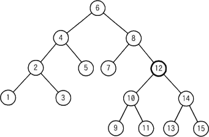
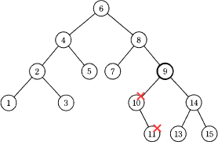
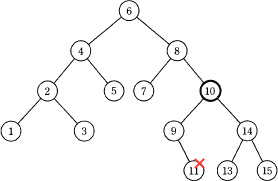
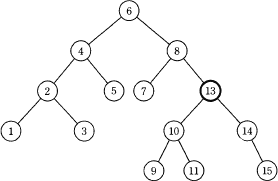
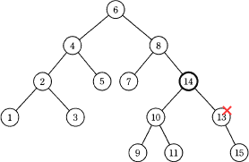

# [令和6年秋期 午前 問5](https://www.ap-siken.com/kakomon/06_aki/q5.html)

#問題 #テクノロジ #アルゴリズムとプログラミング #データ構造

解説を表示解説を隠す

<strong>問5</strong>　次の2分探索木から要素12を削除したとき，その位置に別の要素を移動するだけで2分探索木を再構成するには，削除された要素の位置にどの要素を移動すればよいか。 

<ul class="ap-choices">
<li class="ap-choice-item ap-wrong">

ア　9

節点である要素9の左部分木に、節点より大きい要素10と要素11が配置されるので不適切です。

</li>
<li class="ap-choice-item ap-wrong">

イ　10

節点である要素10の左部分木に、節点より大きい要素11が配置されるので不適切です。

</li>
<li class="ap-choice-item ap-correct">

ウ　13

正しい。節点である要素13の左部分木に要素9、要素10、要素11、右部分木に要素14、要素15が配置されることになるので適切です。

</li>
<li class="ap-choice-item ap-wrong">

エ　14

節点である要素14の右部分木に、節点より小さい要素13が配置されるので不適切です。

</li>
</ul>

<h4>解説</h4>

<a href="用語/2分探索木" class="internal-link" data-href="用語/2分探索木">2分探索木</a>は、<a href="用語/2分木" class="internal-link" data-href="用語/2分木">2分木</a>の各節にデータをもたせることで探索を行えるようにした<a href="用語/木構造" class="internal-link" data-href="用語/木構造">木構造</a>です。各節がもつデータは「その節から出る左部分木にあるどのデータよりも大きく、右部分木のどのデータよりも小さい」という性質があり、これを利用して効率的なデータ探索を可能にしています。

設問の<a href="用語/2分探索木" class="internal-link" data-href="用語/2分探索木">2分探索木</a>から要素12が削除された際、<a href="用語/2分探索木" class="internal-link" data-href="用語/2分探索木">2分探索木</a>の性質（要素同士の大小関係）を保つためには、12に最も近い値である要素11または要素13を新たな節点とします。この方法により他の要素の移動することなく<a href="用語/2分探索木" class="internal-link" data-href="用語/2分探索木">2分探索木</a>が再構成されます。したがって「ウ」の13が正解となります。

節点である要素9の左部分木に、節点より大きい要素10と要素11が配置されるので不適切です。 

節点である要素10の左部分木に、節点より大きい要素11が配置されるので不適切です。 

正しい。節点である要素13の左部分木に要素9、要素10、要素11、右部分木に要素14、要素15が配置されることになるので適切です。 

節点である要素14の右部分木に、節点より小さい要素13が配置されるので不適切です。 

