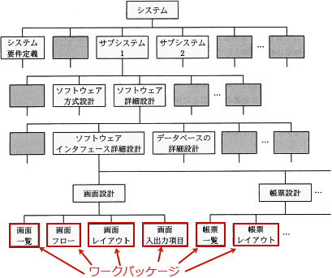

# [令和6年秋期 午前 問52](https://www.ap-siken.com/kakomon/06_aki/q52.html)

#問題 #マネジメント #プロジェクトマネジメント #プロジェクトのスコープ

解説を表示解説を隠す

<strong>問52</strong>　PMBOKガイド第7版によれば，WBSの最下位のレベルの作業を何と呼ぶか。

<ul class="ap-choices">
<li class="ap-choice-item ap-wrong">

ア　WBS辞書

<a href="用語/WBS辞書" class="internal-link" data-href="用語/WBS辞書">WBS辞書</a>は、<a href="用語/WBS" class="internal-link" data-href="用語/WBS">WBS</a>の各構成要素に関する詳細な成果物、<a href="用語/アクティビティ" class="internal-link" data-href="用語/アクティビティ">アクティビティ</a>、<a href="用語/スケジュール" class="internal-link" data-href="用語/スケジュール">スケジュール</a>などの情報が記載された文書です。<a href="用語/スコープ" class="internal-link" data-href="用語/スコープ">スコープ</a>記述書・<a href="用語/WBS" class="internal-link" data-href="用語/WBS">WBS</a>とともに<a href="用語/スコープ" class="internal-link" data-href="用語/スコープ">スコープ</a><a href="用語/ベースライン" class="internal-link" data-href="用語/ベースライン">ベースライン</a>を構成します。

</li>
<li class="ap-choice-item ap-wrong">

イ　アクティビティ・リスト

<a href="用語/アクティビティ" class="internal-link" data-href="用語/アクティビティ">アクティビティ</a>・リストは、<a href="用語/プロジェクト" class="internal-link" data-href="用語/プロジェクト">プロジェクト</a>で実施されるべく<a href="用語/スケジュール" class="internal-link" data-href="用語/スケジュール">スケジュール</a>に組み込まれた個々の作業（<a href="用語/アクティビティ" class="internal-link" data-href="用語/アクティビティ">アクティビティ</a>）を一覧化した文書です。各<a href="用語/アクティビティ" class="internal-link" data-href="用語/アクティビティ">アクティビティ</a>には名称と識別子が付与され、その詳細な作業範囲が記載されます。<a href="用語/PMBOK" class="internal-link" data-href="用語/PMBOK">PMBOK</a>第7版では「<a href="用語/スケジュール" class="internal-link" data-href="用語/スケジュール">スケジュール</a>・<a href="用語/アクティビティ" class="internal-link" data-href="用語/アクティビティ">アクティビティ</a>を表にした文書」と定義しています。

</li>
<li class="ap-choice-item ap-wrong">

ウ　プロジェクト・スコープ

<a href="用語/プロジェクト" class="internal-link" data-href="用語/プロジェクト">プロジェクト</a>・<a href="用語/スコープ" class="internal-link" data-href="用語/スコープ">スコープ</a>は、<a href="用語/プロジェクト" class="internal-link" data-href="用語/プロジェクト">プロジェクト</a>の実施範囲のことで、成果物とそれを生み出すために行う作業のすべてを定義したものです。<a href="用語/PMBOK" class="internal-link" data-href="用語/PMBOK">PMBOK</a>第7版では「所定のフィーチャーや機能を持つプロダクト、サービス、所産を生み出すために実行される作業」と定義しています。

</li>
<li class="ap-choice-item ap-correct">

エ　ワーク・パッケージ

正しい。<a href="用語/PMBOK" class="internal-link" data-href="用語/PMBOK">PMBOK</a>第7版では「<a href="用語/WBS" class="internal-link" data-href="用語/WBS">WBS</a>の最下位のレベルに定義される作業。この作業にかかる<a href="用語/コスト" class="internal-link" data-href="用語/コスト">コスト</a>と所要時間を見積り、マネジメントする」と定義しています。

</li>
</ul>

<h4>解説</h4>

<a href="用語/WBS" class="internal-link" data-href="用語/WBS">WBS</a>(Work Breakdown Structure)は、<a href="用語/プロジェクト" class="internal-link" data-href="用語/プロジェクト">プロジェクト</a>目標を達成し、必要な成果物を過不足なく作成するために、<a href="用語/プロジェクトチーム" class="internal-link" data-href="用語/プロジェクトチーム">プロジェクトチーム</a>が実行すべき作業を、成果物を主体に階層的に<a href="用語/要素分解" class="internal-link" data-href="用語/要素分解">要素分解</a>したものです。この階層的に細分化された構造図の中で最下層に位置する個々の部分を<a href="用語/ワークパッケージ" class="internal-link" data-href="用語/ワークパッケージ">ワークパッケージ</a>といい、<a href="用語/プロジェクト" class="internal-link" data-href="用語/プロジェクト">プロジェクト</a>を実施する際の<a href="用語/コントロール" class="internal-link" data-href="用語/コントロール">コントロール</a>単位となります。したがって「エ」が正解です。

