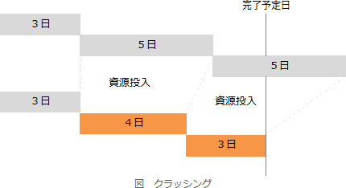

# [令和6年秋期 午前 問54](https://www.ap-siken.com/kakomon/06_aki/q54.html)

#問題 #マネジメント #プロジェクトマネジメント #プロジェクトの時間

解説を表示解説を隠す

<strong>問54</strong>　プロジェクトマネジメントにおけるファストトラッキングの例として，適切なものはどれか。

<ul class="ap-choices">
<li class="ap-choice-item ap-wrong">

ア　クリティカルパス上のアクティビティの開始が遅れたので，そのアクティビティに人的資源を追加した。

これは<a href="用語/クラッシング" class="internal-link" data-href="用語/クラッシング">クラッシング</a>の説明です。

</li>
<li class="ap-choice-item ap-wrong">

イ　コストを削減するために，これまで承認されていた残業を禁止した。

<a href="用語/ファストトラッキング" class="internal-link" data-href="用語/ファストトラッキング">ファストトラッキング</a>はコスト削減ではなく、スケジュール短縮を目的とする手法です。

</li>
<li class="ap-choice-item ap-wrong">

ウ　仕様の確定が大幅に遅れたので，プロジェクトの完了予定日を延期した。

完了予定日を遅らせて対応することは、<a href="用語/ファストトラッキング" class="internal-link" data-href="用語/ファストトラッキング">ファストトラッキング</a>ではありません。

</li>
<li class="ap-choice-item ap-correct">

エ　設計が終わったモジュールから順にプログラム開発を実施するようにして，スケジュールを短縮した。

正しい。工程を並行して実施しているので、<a href="用語/ファストトラッキング" class="internal-link" data-href="用語/ファストトラッキング">ファストトラッキング</a>の例です。

</li>
</ul>

<h4>解説</h4>

プロジェクトの<a href="用語/スコープ" class="internal-link" data-href="用語/スコープ">スコープ</a>を縮小することなく、プロジェクトスケジュールの所要時間を短縮するには主に2つの手法があります。

<a href="用語/クラッシング" class="internal-link" data-href="用語/クラッシング">クラッシング</a>は、<a href="用語/クリティカルパス" class="internal-link" data-href="用語/クリティカルパス">クリティカルパス</a>上のアクティビティに資源を追加投入してスケジュール短縮を図る手法です。メンバーの時間外勤務を増やしたり、業務内容に精通したメンバーを新たに増員するなどがあります。

<a href="用語/ファストトラッキング" class="internal-link" data-href="用語/ファストトラッキング">ファストトラッキング</a>は、当初の計画では順番に行う予定だったアクティビティを並行して行うことによってスケジュール短縮を図る手法です。全体の設計が完了する前に、仕様が固まっているモジュールの開発を開始するなどがあります。

したがって「エ」が正解です。

