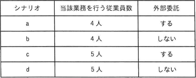

# [令和6年秋期 午前 問64](https://www.ap-siken.com/kakomon/06_aki/q64.html)

#問題 #ストラテジ #システム戦略 #業務プロセス

解説を表示解説を隠す

<strong>問64</strong>　BPRによって業務を見直した場合，これまで従業員5人で年間計9,000時間掛かっていた業務が7,000時間で実現可能なことと，その7,000時間のうちの2,000時間分の業務は外部委託が可能なことが分かった。この結果を基にBPRを実施した次のシナリオaからdのうち，当該部門において，年間当たりの金額面の効果が最も高いものはどれか。なお，いずれのシナリオも年初から実施することとし，条件に記載した時間や費用以外は考慮しないものとする。  〔条件〕 年間計9,000時間の内訳は従業員1人当たり1,800時間とする。 従業員1人当たりの年間の人件費は600万円とする。 外部委託が可能な2,000時間分の業務を，外部委託した場合の年間費用は700万円とする。外部委託の契約は1年単位で年間費用の700万円は固定である。 従業員の空いた時間は別の付加価値業務が行えるようになり，従業員1人につき100時間当たり20万円の利益を得ることができる。 従業員4人で当該業務を行う場合は，残り1人は他部門に異動する。当該部門では，1人分の人件費の削減効果だけを考慮する。 BPR実施後，当該業務に関わらない従業員の人件費は金額面の効果とみなす。 

<ul class="ap-choices">
<li class="ap-choice-item ap-wrong">

ア　シナリオa

従業員4人で1人分の人件費600万円を削減し、2,000時間を外部委託（700万円）する。従業員担当5,000時間に対し余剰2,200時間の<a href="用語/付加価値" class="internal-link" data-href="用語/付加価値">付加価値</a>効果440万円。効果金額は600－700＋440＝340万円。

</li>
<li class="ap-choice-item ap-correct">

イ　シナリオb

正しい。従業員4人で1人分の人件費600万円を削減し、7,000時間すべてを従業員が担当。余剰200時間の<a href="用語/付加価値" class="internal-link" data-href="用語/付加価値">付加価値</a>効果40万円。効果金額は600＋40＝640万円。

</li>
<li class="ap-choice-item ap-wrong">

ウ　シナリオc

従業員5人のまま2,000時間を外部委託（700万円）。従業員担当5,000時間に対し余剰4,000時間の<a href="用語/付加価値" class="internal-link" data-href="用語/付加価値">付加価値</a>効果800万円。効果金額は－700＋800＝100万円。

</li>
<li class="ap-choice-item ap-wrong">

エ　シナリオd

従業員5人のまま7,000時間すべてを従業員が担当。余剰2,000時間の<a href="用語/付加価値" class="internal-link" data-href="用語/付加価値">付加価値</a>効果400万円。効果金額は400万円。

</li>
</ul>

<h4>解説</h4>

各<a href="用語/シナリオ" class="internal-link" data-href="用語/シナリオ">シナリオ</a>の効果金額は次のとおりです。

<a href="用語/シナリオ" class="internal-link" data-href="用語/シナリオ">シナリオ</a>a：従業員は4人なので1人分の人件費600万円が削減されます。また、年間700万円の<a href="用語/費用" class="internal-link" data-href="用語/費用">費用</a>で外部委託を実施します。必要作業時間7,000時間のうち2,000時間を外部委託するので、従業員が担当する作業時間は5,000時間です。従業員の年間業務時間は「1,800時間×4人＝7,200時間」なので、「7,200－5,000＝2,200時間」が余剰となります。これを<a href="用語/付加価値" class="internal-link" data-href="用語/付加価値">付加価値</a>業務に充てることによる効果は「20万円×22＝440万円」です。したがって、効果金額は「600－700＋440＝340万円」となります。

<a href="用語/シナリオ" class="internal-link" data-href="用語/シナリオ">シナリオ</a>b：従業員は4人なので1人分の人件費600万円が削減されます。7,000時間すべてを従業員が担当し、従業員の年間業務時間は「1,800時間×4人＝7,200時間」なので、「7,200－7,000＝200時間」が余剰となります。これを<a href="用語/付加価値" class="internal-link" data-href="用語/付加価値">付加価値</a>業務に充てることによる効果は「20万円×2＝40万円」です。したがって、効果金額は「600＋40＝640万円」となります。

<a href="用語/シナリオ" class="internal-link" data-href="用語/シナリオ">シナリオ</a>c：年間700万円の<a href="用語/費用" class="internal-link" data-href="用語/費用">費用</a>で外部委託を実施します。必要作業時間7,000時間のうち2,000時間を外部委託するので、従業員が担当する作業時間は5,000時間です。従業員の年間業務時間は「1,800時間×5人＝9,000時間」なので、「9,000－5,000＝4,000時間」が余剰となります。これを<a href="用語/付加価値" class="internal-link" data-href="用語/付加価値">付加価値</a>業務に充てることによる効果は「20万円×40＝800万円」です。したがって、効果金額は「－700＋800＝100万円」となります。

<a href="用語/シナリオ" class="internal-link" data-href="用語/シナリオ">シナリオ</a>d：7,000時間すべてを従業員が担当し、従業員の年間業務時間は「1,800時間×5人＝9,000時間」なので、「9,000－7,000＝2,000時間」が余剰となります。これを<a href="用語/付加価値" class="internal-link" data-href="用語/付加価値">付加価値</a>業務に充てることによる効果は「20万円×20＝400万円」です。したがって、効果金額は「400万円」となります。

効果金額の大きい順にb、d、a、cなので、正解は「イ」です。

