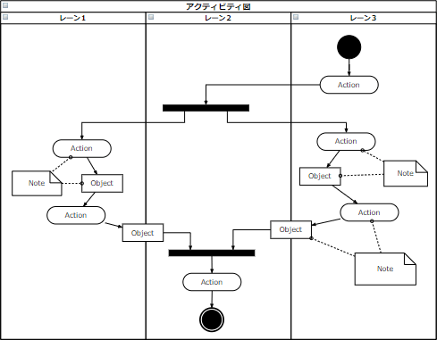

# [令和6年秋期 午前 問66](https://www.ap-siken.com/kakomon/06_aki/q66.html)

#問題 #ストラテジ #システム企画 #要件定義

解説を表示解説を隠す

<strong>問66</strong>　UMLの図のうち，業務要件定義において，業務フローを記述する際に使用する，処理の分岐や並行処理，処理の同期などを表現できる図はどれか。

<ul class="ap-choices">
<li class="ap-choice-item ap-correct">

ア　アクティビティ図

正しい。<a href="用語/アクティビティ図" class="internal-link" data-href="用語/アクティビティ図">アクティビティ図</a>は、並行処理を含む一連の<a href="用語/業務フロー" class="internal-link" data-href="用語/業務フロー">業務フロー</a>を記述する図です。

</li>
<li class="ap-choice-item ap-wrong">

イ　クラス図

これは<a href="用語/クラス図" class="internal-link" data-href="用語/クラス図">クラス図</a>の説明です。クラス、属性、クラス間の関係からシステムを記述する静的な構造図です。

</li>
<li class="ap-choice-item ap-wrong">

ウ　状態マシン図

これは状態マシン図の説明です。時間の経過や状況の変化に応じて状態が変わるようなシステムの振る舞いを記述するときに適した図です。

</li>
<li class="ap-choice-item ap-wrong">

エ　ユースケース図

これは<a href="用語/ユースケース図" class="internal-link" data-href="用語/ユースケース図">ユースケース図</a>の説明です。システムに要求される機能をユーザーの視点から示した図で、ユーザー要件のモデリングに使用されます。

</li>
</ul>

<h4>解説</h4>

<a href="用語/アクティビティ図" class="internal-link" data-href="用語/アクティビティ図">アクティビティ図</a>は、ビジネスプロセスの流れやプログラムの制御フローのような一連の手続きを可視化できる図です。<a href="用語/フローチャート" class="internal-link" data-href="用語/フローチャート">フローチャート</a>の<a href="用語/UML" class="internal-link" data-href="用語/UML">UML</a>版と言えるでしょう。<a href="用語/フローチャート" class="internal-link" data-href="用語/フローチャート">フローチャート</a>と似た表記法で処理の流れを記述できるほか、処理の分岐やマージ、並行処理のフォークやジョイン、タイマー制御や例外処理なども表現できるようになっています。

試験問題においては<a href="用語/アクティビティ図" class="internal-link" data-href="用語/アクティビティ図">アクティビティ図</a>の特徴を以下のように表現しています。ある振る舞いから次の振る舞いへの<a href="用語/制御の流れ" class="internal-link" data-href="用語/制御の流れ">制御の流れ</a>を表現する多くの並行処理を含むシステムの、オブジェクトの振る舞いが記述できる現実のビジネスプロセスで生じる並行処理が表現できる

