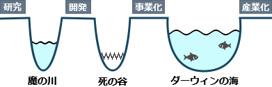

# [令和6年秋期 午前 問70](https://www.ap-siken.com/kakomon/06_aki/q70.html)

#問題 #ストラテジ #技術戦略マネジメント #技術開発戦略の立案

解説を表示解説を隠す

<strong>問70</strong>　企業における研究，開発，事業化，そして産業化へとステージが移行する過程の中で，事業化から産業化に移行するときの，競合製品との競争過程にある障壁を何と呼ぶか。

<ul class="ap-choices">
<li class="ap-choice-item ap-wrong">

ア　キャズム

これは<a href="用語/キャズム" class="internal-link" data-href="用語/キャズム">キャズム</a>の説明です。初期市場とメイン市場の間の障壁であり、本問の「事業化から産業化」とは異なります。

</li>
<li class="ap-choice-item ap-wrong">

イ　死の谷

これは<a href="用語/死の谷" class="internal-link" data-href="用語/死の谷">死の谷</a>の説明です。開発（製品・サービス開発）と事業化の間に存在する障壁です。

</li>
<li class="ap-choice-item ap-correct">

ウ　ダーウィンの海

正しい。詳細：<a href="用語/ダーウィンの海" class="internal-link" data-href="用語/ダーウィンの海">ダーウィンの海</a>

</li>
<li class="ap-choice-item ap-wrong">

エ　魔の川

これは<a href="用語/魔の川" class="internal-link" data-href="用語/魔の川">魔の川</a>の説明です。研究と開発の間に存在する障壁です。

</li>
</ul>

<h4>解説</h4>

研究・開発・事業化・産業化の各ステージ移行には、それぞれ異なる障壁があります。<a href="用語/魔の川" class="internal-link" data-href="用語/魔の川">魔の川</a>は研究と開発の間、<a href="用語/死の谷" class="internal-link" data-href="用語/死の谷">死の谷</a>は開発と事業化の間、<a href="用語/ダーウィンの海" class="internal-link" data-href="用語/ダーウィンの海">ダーウィンの海</a>は事業化と産業化の間に位置します。<a href="用語/キャズム" class="internal-link" data-href="用語/キャズム">キャズム</a>は<a href="用語/イノベーション" class="internal-link" data-href="用語/イノベーション">イノベーション</a>普及の文脈で、初期市場とメイン市場の間の障壁を指します。

本問は「事業化から産業化に移行するとき」、すなわち新技術製品の販売開始後に競合製品との生存競争や顧客ニーズの変化を乗り越えて産業化に達する段階の障壁を問うています。この障壁は「<a href="用語/ダーウィンの海" class="internal-link" data-href="用語/ダーウィンの海">ダーウィンの海</a>」と呼ばれます。したがって「ウ」が正解です。

