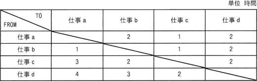

# [令和6年秋期 午前 問72](https://www.ap-siken.com/kakomon/06_aki/q72.html)

#問題 #ストラテジ #ビジネスインダストリ #エンジニアリングシステム

解説を表示解説を隠す

<strong>問72</strong>　製造業のA社では，NC工作機械を用いて，四つの仕事a～dを行っている。各仕事間の段取り時間は表のとおりである。合計の段取り時間が最小になるように仕事を行った場合の合計段取り時間は何時間か。ここで，仕事はどの順序で行ってもよく，a～dを一度ずつ行うものとし，FROMからTOへの段取り時間で算出する。 

<ul class="ap-choices">
<li class="ap-choice-item ap-correct">

ア　4

正しい。24通りの順序を検討する<a href="用語/組合せ最適化問題" class="internal-link" data-href="用語/組合せ最適化問題">組合せ最適化問題</a>であり、段取り時間が1時間の遷移を優先すると b→a→c→d の順で合計4時間となります。

</li>
<li class="ap-choice-item ap-wrong">

イ　5

最小順序（b→a→c→d）の合計段取り時間は4時間であり，5時間にはなりません。

</li>
<li class="ap-choice-item ap-wrong">

ウ　6

最小順序の合計段取り時間は4時間であり，6時間にはなりません。

</li>
<li class="ap-choice-item ap-wrong">

エ　7

最小順序の合計段取り時間は4時間であり，7時間にはなりません。

</li>
</ul>

<h4>解説</h4>

四つの仕事a～dの順序のすべての組合せ(24通り)に対して、段取り時間を検証していけばなんとかなります。このとき段取り時間が最小の"1"である仕事の流れを生かせば早く解答にたどり着けるはずです。段取り時間が1時間の「a→c / b→a / b→c」を使う順序の組合せを優先して使うことを考えると、b→a(1時間)とa→c(1時間)の順序を使って、b→a→cが2時間の段取り時間で構成できることがわかります。残る仕事dは、他の作業の後ろまたは作業cの前なら2時間ですが、b→a→cの最初は仕事bですので、仕事cの後ろに回すのが適切となります。以上より、合計段取り時間が最小となる順序は、仕事b→(1時間)→仕事a→(1時間)→仕事c→(2時間)→仕事d したがって、合計段取り時間は「1＋1＋2＝4時間」となります。各仕事を1回ずつ訪問する順序の最適化は<a href="用語/巡回セールスマン問題" class="internal-link" data-href="用語/巡回セールスマン問題">巡回セールスマン問題</a>として整理できます。各仕事間の段取り時間の数値は問題文の表（図）を参照してください。

