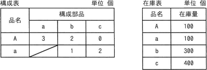
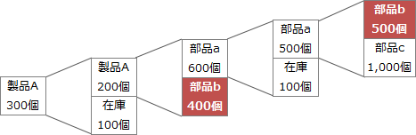

# [令和6年秋期 午前 問73](https://www.ap-siken.com/kakomon/06_aki/q73.html)

#問題 #ストラテジ #企業活動 #業務分析・データ利活用

解説を表示解説を隠す

<strong>問73</strong>　構成表の製品Aを300個出荷しようとするとき，部品bの正味所要量は何個か。ここで，A，a，b，cの在庫量は在庫表のとおりとする。また，他の仕掛残，注文残，引当残などはないものとする。 

<ul class="ap-choices">
<li class="ap-choice-item ap-wrong">

ア　200

製品Aを300個出荷するために新たに製造する数量（在庫100個を差し引いた後）であり、部品bの正味所要量ではありません。

</li>
<li class="ap-choice-item ap-correct">

イ　600

正しい。構成表に沿って段階的に部品所要量を積み上げ、部品bの在庫300個を差し引いた正味所要量です。詳細：<a href="用語/MRP" class="internal-link" data-href="用語/MRP">MRP</a>

</li>
<li class="ap-choice-item ap-wrong">

ウ　900

部品bの在庫を差し引く前の総所要量（400＋500）です。正味所要量ではありません。

</li>
<li class="ap-choice-item ap-wrong">

エ　1,500

本問の構成表・在庫表に基づく正味所要量の計算結果ではありません。

</li>
</ul>

<h4>解説</h4>

製品Aの在庫は100個なので、300個出荷するには残り200個を製造しなければなりません。 製品Aを1個作るためには部品aが3個、部品bが2個必要なので、200個製造するには、部品aが600個、部品bが400個必要となります。 さらに部品aを1つ製造するためには、部品bが1個、部品cが2個必要です。600個のうち100個は在庫を使用するので残りの500個を製造するためには、部品bが500個、部品cが1,000個必要となります。 ここまでに必要になった部品bの数量は、400＋500＝900個 ここから部品bの在庫300個を引くと、900－300＝600個 したがって、部品bの正味所要量は600個であることがわかります。

