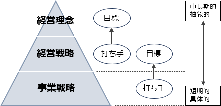

# [令和6年秋期 午前 問74](https://www.ap-siken.com/kakomon/06_aki/q74.html)

#問題 #ストラテジ #企業活動 #経営・組織論

解説を表示解説を隠す

<strong>問74</strong>　企業経営において，経営理念，経営戦略，事業戦略は，経営理念を最上位とするピラミッドを形成している。経営理念，経営戦略，事業戦略の関係性で適切なものはどれか。

<ul class="ap-choices">
<li class="ap-choice-item ap-wrong">

ア　経営理念，経営戦略，事業戦略のピラミッドは上位ほど具体的な内容であるのに対して，下位にいくほど抽象的な内容となっている。

ピラミッドは上位にいくほど抽象的、下位にいくほど具体的な内容です。

</li>
<li class="ap-choice-item ap-wrong">

イ　経営理念，経営戦略，事業戦略のピラミッドは上位ほど短期的な視点であるのに対して，下位にいくほど中長期的な視点となっている。

ピラミッドは上位にいくほど中長期的、下位にいくほど短期な内容です。

</li>
<li class="ap-choice-item ap-correct">

ウ　経営理念を達成するために経営戦略を策定し，経営戦略という目標を達成するために事業戦略に分解する。

正しい。最上位の経営理念を達成するための打ち手が一階層下の経営戦略、経営戦略の目標を達成するための打ち手がさらに一階層下の事業戦略です。

</li>
<li class="ap-choice-item ap-wrong">

エ　経営理念を達成するために事業戦略を策定し，事業戦略という目標を達成するために経営戦略に分解する。

3階層のアプローチでは、経営理念を達成するために経営戦略を策定し、それを事業戦略に分解するという順序が適切です。

</li>
</ul>

<h4>解説</h4>

経営理念、経営戦略、事業戦略は次のような概念です。

<strong>経営理念（<a href="用語/基本理念" class="internal-link" data-href="用語/基本理念">基本理念</a>）</strong>：企業が目指す理想や存在意義を示す指針。企業が果たしたいミッション（使命）や提供したいバリュー（価値）、企業の経営姿勢や行動規範を端的に示したもの。

<strong>経営戦略</strong>：企業全体としての中長期的な目標を達成するための基本方針や計画。

<strong>事業戦略</strong>：各事業部門や特定の分野での<a href="用語/競争優位" class="internal-link" data-href="用語/競争優位">競争優位</a>を築くための具体的な方針や計画。

