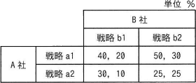
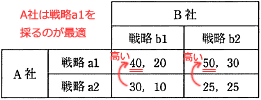
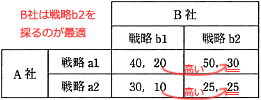

# [令和6年秋期 午前 問75](https://www.ap-siken.com/kakomon/06_aki/q75.html)

#問題 #ストラテジ #企業活動 #業務分析・データ利活用

解説を表示解説を隠す

<strong>問75</strong>　A社とB社がそれぞれ2種類の戦略を採る場合の市場シェアが表のように予想されるとき，ナッシュ均衡，すなわち互いの戦略が相手の戦略に対して最適になっている組合せはどれか。ここで，表の各欄において，左側の数値がA社のシェア，右側の数値がB社のシェアとする。 

<ul class="ap-choices">
<li class="ap-choice-item ap-wrong">

ア　A社が戦略a1，B社が戦略b1を採る組合せ

A社がa1を採る場合，B社はb2の方がシェアが高くなるため，b1を採る組合せは<a href="用語/ナッシュ均衡" class="internal-link" data-href="用語/ナッシュ均衡">ナッシュ均衡</a>ではありません。

</li>
<li class="ap-choice-item ap-correct">

イ　A社が戦略a1，B社が戦略b2を採る組合せ

正しい。A社はB社の戦略にかかわらずa1，B社はA社の戦略にかかわらずb2を採るのがそれぞれ最適であり，(a1, b2)が<a href="用語/ナッシュ均衡" class="internal-link" data-href="用語/ナッシュ均衡">ナッシュ均衡</a>です。

</li>
<li class="ap-choice-item ap-wrong">

ウ　A社が戦略a2，B社が戦略b1を採る組合せ

A社はB社の戦略にかかわらずa1の方がシェアが高いため，a2を採る組合せは<a href="用語/ナッシュ均衡" class="internal-link" data-href="用語/ナッシュ均衡">ナッシュ均衡</a>ではありません。

</li>
<li class="ap-choice-item ap-wrong">

エ　A社が戦略a2，B社が戦略b2を採る組合せ

A社はB社の戦略にかかわらずa1の方がシェアが高いため，a2を採る組合せは<a href="用語/ナッシュ均衡" class="internal-link" data-href="用語/ナッシュ均衡">ナッシュ均衡</a>ではありません。

</li>
</ul>

<h4>解説</h4>

A社が得るシェアに注目すると、B社がどちらの戦略を採った場合でも戦略a1を採るケースの方がシェアが高くなるのでA社は戦略a1を採用します。

B社が得るシェアに注目すると、A社がどちらの戦略を採った場合でも戦略b2を採るケースの方がシェアが高くなるのでB社は戦略b2を採用します。

したがってこの条件では、A社が戦略a1、B社が戦略b2を採る組合せになります。

